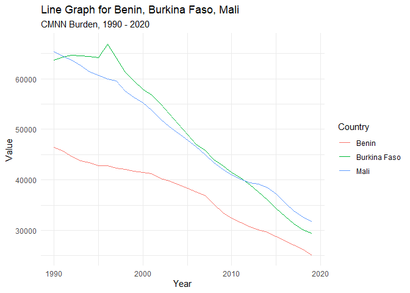
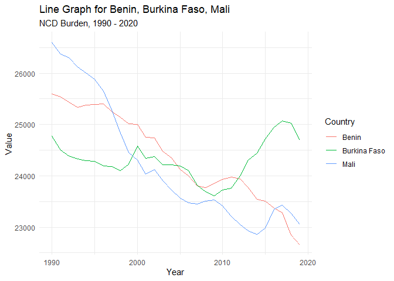
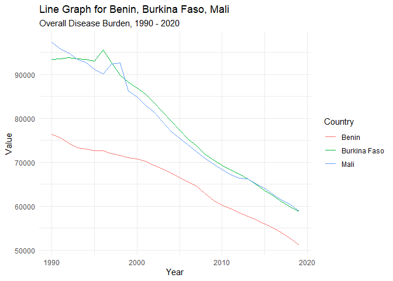

Global Disease Burden Analysis
================
Tavershima Adongo

# Introduction

This document compares the Disability-Adjusted Life Year (DALY) diseases
burden for three countries: Bein, Burkina Faso, and Mali. We compare the
burden due to communicable, maternal, neonatal, and nutritional diseases
(CMNN), non-communicable diseases (NCDs), and overall disease burden for
these countries.

The source data is from the Institute for Health Metrics and Evaluation
(IHME) Global Burden of Disease (GBD) study.

# Communicable, Maternal, Neonatal, and Nutritional Disease Burden (CMNN)

## Table of Estimates for CMNN Burden Over Time

| Year | Benin | Burkina Faso |  Mali |
|-----:|------:|-------------:|------:|
| 1990 | 46487 |        63756 | 65417 |
| 1991 | 45740 |        64259 | 64433 |
| 1992 | 44594 |        64707 | 63690 |
| 1993 | 43724 |        64619 | 62661 |
| 1994 | 43363 |        64486 | 61476 |
| 1995 | 42832 |        64184 | 60708 |
| 1996 | 42830 |        66892 | 59990 |
| 1997 | 42326 |        64141 | 59604 |
| 1998 | 42088 |        61269 | 57608 |
| 1999 | 41664 |        59629 | 56312 |
| 2000 | 41442 |        57930 | 55261 |
| 2001 | 41199 |        56883 | 53811 |
| 2002 | 40262 |        54955 | 52022 |
| 2003 | 39755 |        53132 | 50549 |
| 2004 | 39052 |        50977 | 49210 |
| 2005 | 38352 |        48976 | 47855 |
| 2006 | 37599 |        46974 | 46490 |
| 2007 | 36818 |        45813 | 45018 |
| 2008 | 35169 |        43993 | 43446 |
| 2009 | 33466 |        42798 | 42041 |
| 2010 | 32388 |        41527 | 41019 |
| 2011 | 31527 |        40393 | 40121 |
| 2012 | 30708 |        39087 | 39405 |
| 2013 | 30151 |        37642 | 39155 |
| 2014 | 29630 |        35989 | 38407 |
| 2015 | 28742 |        34316 | 37223 |
| 2016 | 27955 |        32767 | 35367 |
| 2017 | 27066 |        31316 | 33877 |
| 2018 | 26195 |        30154 | 32696 |
| 2019 | 25070 |        29327 | 31637 |

## Plot Showing Trends in CMNN Burden Over Time

<!-- -->

## Summary of CMNN Burden Findings

Overall, the DALYs for the CMNN in these countries seem to fall within
the period under review. This maybe due to effect of improved
infrastructure or better healthcare over the years. Benin seems to have
a more slower and steady fall, perhaps due to a smaller population.

# Non-Communicable Disease Burden (NCD)

## Table of Estimates for NCD Burden Over Time

| Year | Benin | Burkina Faso |  Mali |
|-----:|------:|-------------:|------:|
| 1990 | 25593 |        24770 | 26604 |
| 1991 | 25536 |        24506 | 26378 |
| 1992 | 25440 |        24386 | 26305 |
| 1993 | 25333 |        24335 | 26121 |
| 1994 | 25379 |        24298 | 26004 |
| 1995 | 25389 |        24288 | 25883 |
| 1996 | 25405 |        24195 | 25655 |
| 1997 | 25255 |        24181 | 25292 |
| 1998 | 25145 |        24100 | 24835 |
| 1999 | 25011 |        24232 | 24456 |
| 2000 | 25005 |        24579 | 24304 |
| 2001 | 24753 |        24344 | 24035 |
| 2002 | 24743 |        24381 | 24123 |
| 2003 | 24481 |        24219 | 23903 |
| 2004 | 24349 |        24217 | 23720 |
| 2005 | 24126 |        24193 | 23563 |
| 2006 | 23995 |        24105 | 23469 |
| 2007 | 23807 |        23817 | 23452 |
| 2008 | 23775 |        23690 | 23513 |
| 2009 | 23855 |        23610 | 23535 |
| 2010 | 23928 |        23725 | 23417 |
| 2011 | 23979 |        23757 | 23215 |
| 2012 | 23941 |        23999 | 23057 |
| 2013 | 23766 |        24306 | 22930 |
| 2014 | 23541 |        24444 | 22863 |
| 2015 | 23514 |        24716 | 22979 |
| 2016 | 23372 |        24946 | 23350 |
| 2017 | 23278 |        25069 | 23431 |
| 2018 | 22851 |        25026 | 23267 |
| 2019 | 22656 |        24699 | 23055 |

## Plot Showing Trends in NCD Burden Over Time

<!-- -->

## Summary of NCD Burden Findings

The DALYs for NCD for the three countries begin to have a decline from
1990, but there is a rise in that of Burkina Faso from around 2010. This
maybe due to some other internal factors such as change in government
policies.

# Overall Disease Burden

## Table of Estimates for Overall Disease Burden Over Time

| Year | Benin | Burkina Faso |  Mali |
|-----:|------:|-------------:|------:|
| 1990 | 76404 |        93406 | 97330 |
| 1991 | 75620 |        93518 | 95861 |
| 1992 | 74339 |        93776 | 94842 |
| 1993 | 73357 |        93599 | 93486 |
| 1994 | 73072 |        93395 | 92700 |
| 1995 | 72604 |        93039 | 91183 |
| 1996 | 72600 |        95594 | 90150 |
| 1997 | 71934 |        92795 | 92344 |
| 1998 | 71566 |        89819 | 92648 |
| 1999 | 70994 |        88249 | 86194 |
| 2000 | 70790 |        86915 | 84920 |
| 2001 | 70192 |        85512 | 83042 |
| 2002 | 69253 |        83608 | 81417 |
| 2003 | 68529 |        81593 | 79366 |
| 2004 | 67544 |        79461 | 77037 |
| 2005 | 66532 |        77370 | 75430 |
| 2006 | 65620 |        75287 | 74027 |
| 2007 | 64574 |        73749 | 72405 |
| 2008 | 62855 |        71788 | 70927 |
| 2009 | 61272 |        70466 | 69556 |
| 2010 | 60275 |        69369 | 68324 |
| 2011 | 59430 |        68273 | 67141 |
| 2012 | 58568 |        67349 | 66363 |
| 2013 | 57738 |        66302 | 66201 |
| 2014 | 56921 |        64868 | 65080 |
| 2015 | 56049 |        63545 | 64097 |
| 2016 | 55080 |        62366 | 62662 |
| 2017 | 54055 |        61058 | 61475 |
| 2018 | 52630 |        59831 | 60443 |
| 2019 | 51243 |        58769 | 58880 |

## Plot Showing Trends in Overall Disease Burden Over Time

<!-- -->
\`\`\`

## Summary of Overall Disease Burden Findings

The DALYs for the overall disease burden for the three countries of
Benin, Burkina Faso and Mali is seen to consistently decrease over time.
Benin seems to have a sharper decline, compared to Burkina Faso and
Mali, seemingly declining at the same pace. Perhaps political structure
might and intervention programmes might have a role to play.
